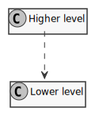
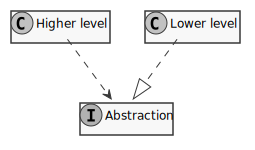

# TDA550

## Design Principles

* **High-Cohesion Low-Coupling (HCLC)**

* **Command-Query Separation (CQS)**

  > Asking a question should not change the answer.

### SOLID Principles

These are principles of the *class design* aspect of Object Oriented
design, [formulated by Robert C. Martin][PrinciplesOfOod].
While these are sound, see [this article][qntm20] for critique on
Robert's book.

* **Single Responsibility Principle (SRP)**

  > Gather together the things that change for the same reasons.
    Separate those things that change for different reasons.
  
  Reformulation of HCLC.
  Though Robert C. Martin emphasizes that code by itself does not warrant change,
  [*people* who request changes][martin14],
  and a change mandated by the tech department of an organization
  should never cause malfunctions for say the financial department.
  
* **Open-Closed Principle (OCP)**
  
  > Software modules should be open for extension,
    but closed for modification.
  
  Write code that does not have to change every time the requirements
  change,
  specifically by *anticipating* possible desired improvements.
  Can be taken too far - easily deletable code already is infinitely extensible.
  
  The primary mechanisms for achieving this are abstraction and
  polymorphism.
  
* **Liskov Substitution Principle (LSP)**
  
  > For `S` to be a subtype of `T`, objects of type `T` may be
    substituted with objects of type `S` without altering any desirable
    program property.&mdash;Barbara Liskov
  
  This is a particular definition of a subtype relation,
  that becomes a prerequisite for conforming to OCP since it
  allows functions to be made to use derived classes instead
  *without them knowing it*.
  
  Something should be a subtype only if its extrinsic behaviour
  can be made consistent with that of its supertype,
  or, to relate to Design by Contract:
  
  > ...when [overriding] a routine, you may only replace its
    precondition by a weaker one, and its postcondition by a stronger
    one.&mdash;Bertrand Meyer
  
  Otherwise we would have to change the client code,
  which violates OCP.
  
* **Interface Segregation Principle (ISP)**
  
  > No client should be forced to depend on methods it does not use.
  
  "Fat" interfaces are a sign of high coupling.
  
* **Dependency Inversion Principle (DIP)**
  
  > Depend on abstractions, not on concrete implementations.
  
  Focusing only on interactions between high- and low-level layers
  when abstracting can lead to less coupled design.
  The most concrete benefit being that the low-level layer
  can be swapped out.
  
  <table>
  <thead>
	  <caption>
		  Instead of higher-level layers depending on lower-level layers,
		  both depend on abstractions around the needs of higher-level layers.
		  The dependency is <em>inverted</em>.
	  </caption>
	  <tr><th>Before</th><th>After</th></tr>
  </thead>
	  <tbody>
		  <tr>
			  <td>
				  <!--
				  @startuml before_dip
				  skinparam monochrome true
				  "Higher level" ..> "Lower level"
				  hide members
				  @enduml
				  -->
				  
			  </td>
			  <td>
				  <!--
				  @startuml after_dip
				  skinparam monochrome true
				  interface Abstraction
				  "Higher level" ..> Abstraction
				  "Lower level" ..|> Abstraction
				  hide members
				  @enduml
				  -->
				  
			  </td>
		  </tr>
	  <tbody>
  </table>

## Design Patterns

[HCLC]: #high-cohesion-low-coupling
[PrinciplesOfOod]: http://butunclebob.com/ArticleS.UncleBob.PrinciplesOfOod
[qntm20]: https://qntm.org/clean
[martin14]: https://blog.cleancoder.com/uncle-bob/2014/05/08/SingleReponsibilityPrinciple.html